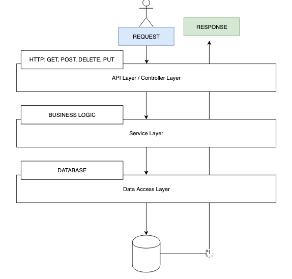

# spring-basics-app

## Tools and Frameworks
1. [Spring](https://spring.io)
2. [Spring Boot](https://spring.io/projects/spring-boot)
3. [Spring Initializr](https://start.spring.io)
4. [Maven](https://maven.apache.org)

## MVC Architechture

MVC stands for Model-View-Controller. This architecture is followed by Spring Framework.

 

Image credits :- "https://www.guru99.com/mvc-tutorial.html"

## Spring Framework
Spring is a framework for Java to create modern applications. It is mostly used for Enterprise solutions. Spring frameworks follows various best practices from industry and is production ready. Spring has many modules in it for RESTful web services, MVC web applications, templating engine, connectivity with various databases (JPA), etc.

## Spring Boot
According to Spring's [official website](https://spring.io/projects/spring-boot) :-

> Spring Boot makes it easy to create stand-alone, production-grade Spring based Applications that you can "just run".

The Spring framework is complex. It requires going through a lengthy procedure in order to start a new Spring project. To avoid starting from scratch and save time, Spring Boot can be used. It uses the Spring framework as a foundation.

To know more differences visit [here.](https://www.baeldung.com/spring-vs-spring-boot)

## Spring Initializr
[Spring Initializr](https://start.spring.io/) is used to quickly begin a project. It reduces the manual work of editing xml files for spring projects. We can add all the required dependencies in this phase. Everything else is taken care of by gradle / maven.

## Maven
[Maven](https://maven.apache.org) is used to for building and managing any Java based project. It reduces the work of developers by handling any dependencies of the project as well as helps in easy packaging and deploying of these dependencies. It ensures a uniform build system by using project object model (POM).

# Current Project Implementation :-



Currently there is implementation only for a REST service. There is no consumption of REST right now.

The general data flow will be :-

**Request -> Controller -> Service Layer -> Data Access Layer -> Database**

The same will be in the reverse order for a response.

## Why such layers ?

These layers help the project become modular, loosely coupled and make dependency injections easier. The modification of one of the layers doesn't require changes in other layers. This saves time refactoring, testing and is generally considered a good practice.

#### Api / Controller Layer :-
This layer is directly contacted by an external entity and a request is made to it. It is also responsible for routing the requests properly and displaying error messages in case of discrepancies. The controller layer also defines which http methods are to be used, and maps the requests properly as well as any request parameters and body alongwith it.

#### Service Layer :-
The service layer as the name suggests services the requests that have been made to it. The service layer has the complete business logic related to the REST requests. The service layer is however the abstraction of the actual implementation and has various methods which fulfill the business logic. It also defines which data access implementation should be chosen (Dependency Injection).

#### Data Access Layer :-
The data access layer is the one responsible to take the abstraction from the service layer and have a concrete implementation for accessing the data from the database. For every database this implementation may change and hence we use abstraction (Service Layer) to keep the modules loosely coupled. It maps the data models and the actual data retrieved from the database. 

## Directory Structure
```bash
├── api
│   └── PersonController.java   
├── dao
│   ├── FakePersonDataAccessService.java 
│   └── PersonDao.java
├── model
│   └── Person.java
├── service
│   └── PersonService.java
├── DemoApplication.java
```

#### api 
This dir holds all the *Controller* classes in it. It is interface between requests and the service layer as well as database layer (indirectly through service layer). Helps to route all the requests.

#### dao
DAO stands for *Data Access Object*. DAO provides *abstraction* to some persistence or database access. It helps map different database implementations without explicitly exposing what to do. It is like a contract for any class that wants to implement it for persistence.

#### model
This dir holds all the model classes. A model helps describe an *entity* in OOP. They include all the fields, getters and setters, etc.

#### service
Services act as an interface between the DAO and the API controllers. It has a concrete implementation of the DAO interface and maps all the functions to that implementation directly which will be used by the controllers.

## Annotations

**TODO** -> Add annotations information.

## References
- https://www.youtube.com/watch?v=r-6BwGW4Sr8
- https://spring.io
- https://maven.apache.org
- https://www.guru99.com/mvc-tutorial.html
- https://dzone.com/articles/understanding-the-basics-of-spring-vs-spring-boot
- https://www.baeldung.com/spring-vs-spring-boot

